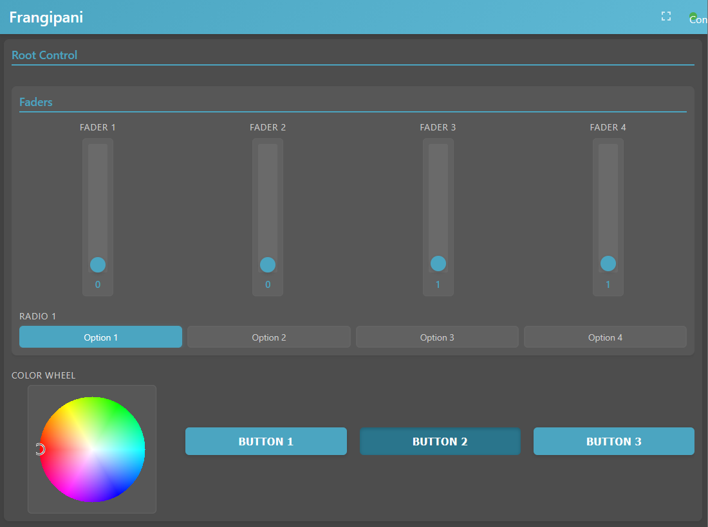

# 🌸 Frangipani - Web app

Static files for Frangipani's web control app

## Example



````json
{
  "label": "Root Control",
  "placement": {
    "column": 0,
    "row": 0,
    "spanColumn": 1,
    "spanRow": 1
  },
  "__type__": "Group",
  "controls": [
    {
      "label": "Faders",
      "placement": {
        "column": 0,
        "row": 1,
        "spanColumn": 4,
        "spanRow": 1
      },
      "__type__": "Group",
      "controls": [
        {
          "label": "Fader 1",
          "placement": {
            "column": 0,
            "row": 0,
            "spanColumn": 1,
            "spanRow": 1
          },
          "__type__": "Fader",
          "address": "/fader1",
          "value": 0.0,
          "max": null,
          "min": null,
          "orientation": 1
        },
        {
          "label": "Fader 2",
          "placement": {
            "column": 1,
            "row": 0,
            "spanColumn": 1,
            "spanRow": 1
          },
          "__type__": "Fader",
          "address": "/fader2",
          "value": 0.0,
          "max": null,
          "min": null,
          "orientation": 1
        },
        {
          "label": "Fader 3",
          "placement": {
            "column": 2,
            "row": 0,
            "spanColumn": 1,
            "spanRow": 1
          },
          "__type__": "Fader",
          "address": "/fader3",
          "value": 0.5,
          "max": null,
          "min": null,
          "orientation": 1
        },
        {
          "label": "Fader 4",
          "placement": {
            "column": 3,
            "row": 0,
            "spanColumn": 1,
            "spanRow": 1
          },
          "__type__": "Fader",
          "address": "/fader4",
          "value": 0.5,
          "max": null,
          "min": null,
          "orientation": 1
        },
        {
          "label": "Radio 1",
          "placement": {
            "column": 0,
            "row": 1,
            "spanColumn": 4,
            "spanRow": 1
          },
          "__type__": "Radio",
          "address": "/radio1",
          "value": 0,
          "options": [
            "Option 1",
            "Option 2",
            "Option 3",
            "Option 4"
          ],
          "orientation": 0
        }
      ]
    },
    {
      "label": "Color Wheel",
      "placement": {
        "column": 0,
        "row": 2,
        "spanColumn": 1,
        "spanRow": 1
      },
      "__type__": "ColorWheel",
      "address": "/color_wheel",
      "value": [
        0.0,
        0.0
      ]
    },
    {
      "label": "Button 1",
      "placement": {
        "column": 1,
        "row": 2,
        "spanColumn": 1,
        "spanRow": 1
      },
      "__type__": "Button",
      "address": "/button1",
      "value": false,
      "is_toggle": false
    },
    {
      "label": "Button 2",
      "placement": {
        "column": 2,
        "row": 2,
        "spanColumn": 1,
        "spanRow": 1
      },
      "__type__": "Button",
      "address": "/button2",
      "value": true,
      "is_toggle": true
    },
    {
      "label": "Button 3",
      "placement": {
        "column": 3,
        "row": 2,
        "spanColumn": 1,
        "spanRow": 1
      },
      "__type__": "Button",
      "address": "/button3",
      "value": false,
      "is_toggle": true
    }
  ]
}
````